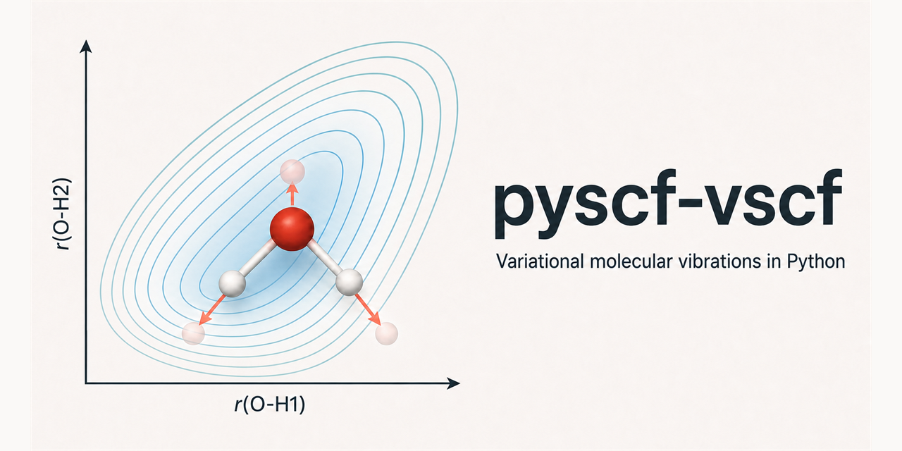

# pyscf-vscf



`pyscf-vscf` is a public-alpha package for PySCF-backed construction and
reduced-dimensional variational analysis of vibrational potential-energy and
dipole-moment surfaces.

The package now contains an actual state-specific VSCF solver for n-mode
Hamiltonians with one-mode terms and explicit two-mode coupling corrections.
It also provides 1D/2D sinc-DVR solvers, overlap-based 2D state assignment,
harmonic and scan workflows, exact constrained normal-coordinate relaxation,
and provenance-checked PES/DMS caches.

VCI is **not implemented**. The present VSCF is reduced-dimensional and uses
rectilinear uniform DVR coordinates with diagonal one-mode kinetic operators.
The package does not claim full-dimensional or general curvilinear VSCF/VCI.

## Install

Install the current alpha from PyPI:

```bash
pip install "pyscf-vscf==0.1.0a4"
```

Install the PySCF-backed workflows as well:

```bash
pip install "pyscf-vscf[pyscf]==0.1.0a4"
```

The source project uses `uv` for development:

```bash
uv sync --extra dev
```

Install the optional electronic-structure backend for PySCF calculations:

```bash
uv sync --extra dev --extra pyscf
```

Pure numerical modules and the VSCF solver do not import PySCF.

## Runnable VSCF Example

The wheel includes a deterministic, PySCF-free coupled two-mode example:

```bash
uv run python -m pyscf_vscf.examples.vscf_two_mode
```

The main API is:

```python
from pyscf_vscf import NModePotential, VSCFSettings, vscf_spectrum
```

`NModePotential` represents

```text
H = sum_i [T_i + V_i(q_i)] + sum_{i<j} V_ij(q_i, q_j)
```

where each `V_ij` is a coupling correction rather than a complete two-mode
potential. Coordinates supplied to `NModePotential` must be in Angstrom.

The current VSCF implementation consumes a one-mode/two-mode PES through the
Python API. `nmode_model_from_pair_surfaces` assembles that representation from
overlapping complete pair surfaces, rejects inconsistent shared one-mode cuts,
and removes independent pair-energy offsets. PySCF does not yet generate an
arbitrary molecular n-mode PES or DMS automatically. VSCF transition
intensities and a VSCF command-line workflow are also not implemented.

## Command Line

The geometry commands below are source-checkout examples; `geom/` is repository
validation material and is not installed into the wheel:

```bash
pyscf-vscf --help
pyscf-vscf --version
pyscf-vscf --mmol geom/HDO.mmol --task harmonic --dispersion none
pyscf-vscf --mmol geom/H2O.mmol --task 1d --bond 0-1 --npts 41
```

PySCF-backed work requires the `pyscf` extra. The legacy
`pyscf_pme_pipeline.py` remains in the source repository for historical
compatibility, but release support and API guarantees apply to the package code
under `src/pyscf_vscf`.

XYZ and MMOL files do not reliably preserve molecular charge and spin. Supply
`--charge` and `--spin` whenever a non-neutral or open-shell geometry is reused.

## Scientific Conventions

- Transition dipoles are reported in Debye, never arbitrary units.
- Integrated cross sections are `integral sigma(omega) d omega` in `m^2/s`.
- Axis-projected values are for polarized light; vector-norm values use the
  isotropic `1/3` orientation average.
- 2D state labels use phase-canonical wavefunction overlaps and expose unique
  labels, mixed-state signatures, participation ratios, dominant-manifold
  weights, and leading signed components.
- Schema-v2 caches fingerprint geometry, isotope masses, charge/spin, every
  electronic-structure setting, scan coordinates, runtime versions, and array
  checksums. Legacy caches fail closed in production loaders.

See the [intensity conventions](https://github.com/diogovalada/pyscf-vscf/blob/main/docs/intensity-conventions.md)
and [validation guide](https://github.com/diogovalada/pyscf-vscf/blob/main/docs/running-validations.md).

## Validation

```bash
uv run ruff check src tests scripts/validate_archived_grids.py \
  scripts/generate_nh3_three_mode.py scripts/expand_nh3_three_mode.py \
  scripts/validate_nh3_three_mode.py
uv run ruff format --check src tests scripts/validate_archived_grids.py \
  scripts/generate_nh3_three_mode.py scripts/expand_nh3_three_mode.py \
  scripts/validate_nh3_three_mode.py
uv run pytest -q
uv run --extra pyscf pytest -m pyscf -q
uv run python scripts/validate_archived_grids.py \
  --nmax 12 --output validation_data/convergence_report.json
uv run python scripts/validate_nh3_three_mode.py
```

The archived-grid analysis performs no electronic-structure recomputation. It
reports state-matched spreads across grid density and coordinate-window
variants for H2O, HDO, and D2O. It also compares the two assigned stretch
fundamentals of each isotopologue against independent ORCA harmonic IR
intensities. The six calculated intensities reproduce the independent scale
and isotope/mode trend within 35.4% relative error. This is a computational
cross-check, not an experimental or rovibrational validation.

On the same archived molecular surfaces and a matched separable kinetic model,
state-specific VSCF is also compared with exact 2D DVR for both fundamentals
and their combination state. This is a molecular solver benchmark, not an
independent validation of the underlying PES or omitted kinetic couplings.

The separate NH3 archive exercises three local N-H coordinates and all three
pair surfaces. State-specific VSCF is compared with exact 3D DVR on the
identical 1MR/2MR Hamiltonian across a documented window-convergence sequence.
The fundamental, binary-combination, and triple-combination manifolds pass the
`25 cm^-1` centroid-spread criterion; the first-overtone manifold is retained
as nonconverged. Across the final three variants, the maximum VSCF/exact
centroid error is `4.43 cm^-1`. Reanalysis uses only the checked-in caches and
does not require PySCF.

## Release Status

The current version is `0.1.0a4`. API changes remain possible during alpha.
The repository includes an MIT license, citation metadata, changelog, CI,
GitHub release automation, an opt-in trusted-publishing workflow, and a release
checklist.
Original validation data are separately licensed under CC BY 4.0; see
`DATA_LICENSE.md` in the source repository.
